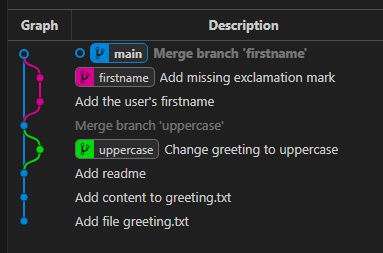

# Git Rebase Kata

This repository is designed to demonstrate how `git rebase` works compared to `git merge`. By following this kata, you will gain hands-on experience with rebasing and merging branches while maintaining a clean commit history.

This kata is inspired by [Eficode Academy's Git Katas](https://github.com/eficode-academy/git-katas/tree/master/rebase-branch).

## Prerequisites

Before starting, ensure you have the following installed:

- **Git** ([Download Git](https://git-scm.com/downloads))
- **Visual Studio Code** ([Download VS Code](https://code.visualstudio.com/))
- **Git Graph extension for VS Code** ([Git Graph Plugin](https://open-vsx.org/vscode/item?itemName=mhutchie.git-graph))

## Scenario Overview

We have three branches in our repository:

- `main`: The main branch containing the latest updates.
- `uppercase`: A feature branch where `Hello` in the greeting file is converted to uppercase.
- `firstname`: A feature branch where a user’s first name is appended to the greeting.

A new commit has been added to `main`, but both `uppercase` and `firstname` branches do not yet contain this commit. We will go through a series of steps to understand the impact of merging and rebasing.

---

## Step-by-Step Guide

### 1. Clone the Repository & Set Up

```sh
# Clone the repository
git clone git@github.com:michelherv/git-kata-rebase.git
cd git-kata-rebase
```

### 2. Check Existing Branches

```sh
git branch --all
```

This should display `main`, `uppercase`, and `firstname` branches.

### 3. Examine the Commit History

```sh
git log --oneline --graph --all
```

Discuss how merging branches without rebasing would impact the commit history.

### 4. Switch to the `uppercase` Branch

```sh
git switch uppercase
```

### 5. Compare `uppercase` Branch Log with `main`

```sh
git log --oneline --graph --decorate --all
```

Observe the differences.

### 6. Rebase `uppercase` onto `main`

```sh
git rebase main
```

#### What Just Happened?

- Git applied the latest `main` changes before replaying the `uppercase` changes on top.
- This ensures a linear commit history.

### 7. Switch to `main` & Merge `uppercase`

```sh
git switch main
git merge uppercase
```

Observe how the commit history looks cleaner compared to a merge without rebase.

### 8. Switch to `firstname` Branch

```sh
git switch firstname
```

### 9. Rebase `firstname` onto `main`

```sh
git rebase main
```

Check the commit history again.

### 10. Add a New Commit to Fix a Forgotten "!"

```sh
echo "!" >> greeting.txt
git add greeting.txt
git commit -m "Add missing exclamation mark"
```

### 11. Merge `firstname` into `main`

```sh
git switch main
git merge firstname
```

### 12. Final Commit History Review

```sh
git log --oneline --graph --decorate --all
```



The log should now display a clean and structured history without unnecessary merge commits.

---

## Summary of Key Learnings

- **Rebasing** keeps the commit history linear and clean by applying changes on top of the latest updates.
- **Merging without rebase** can result in unnecessary merge commits that make the history harder to follow.
- **Git Graph Extension** provides a visual representation of commit history, making it easier to understand the impact of rebase and merge operations.

Happy coding! 🚀
